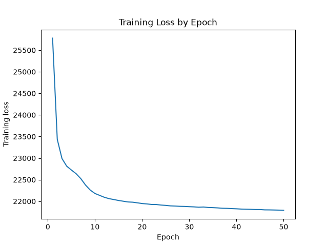
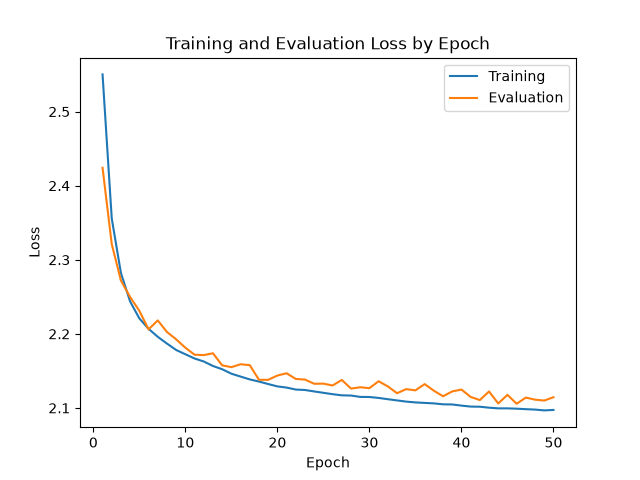
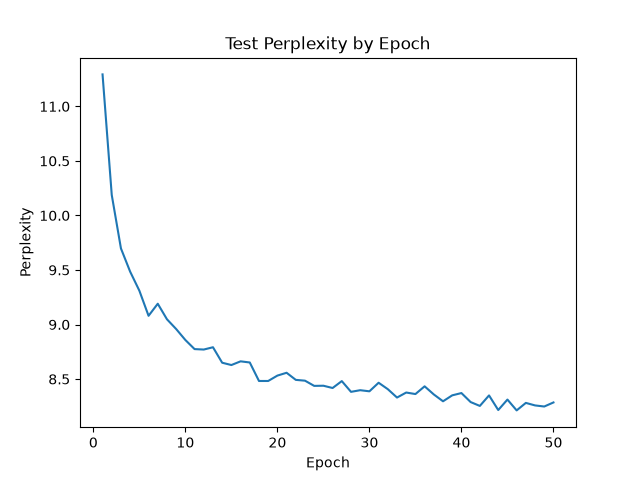
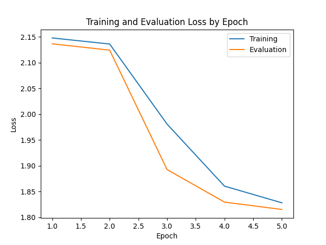
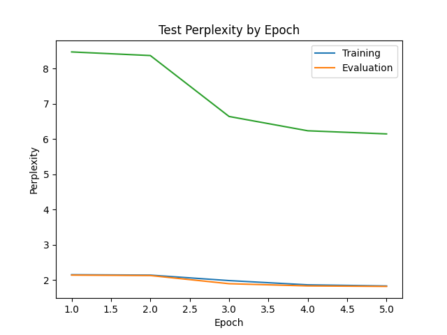

## Language Model Architecture Implementation

### History of Language Model
- RNN
- Seq-to-Seq (LSTM)
- Transformer (Attention Mechanism)
- BERT(RoBERTa, ALBERT, DeBERTa)
- GPT (GPT-2,3, InstructGPT, ChatGPT, GPT4,5)
- Other (Meta → Llama, DeepSeek → DeepSeek-R1)

### Reference
- Transformer (https://arxiv.org/abs/1706.03762)
- MoE (https://arxiv.org/abs/1701.06538)
- BERT (Pre-training of Deep Bidirectional Transformers for Language Understanding)
- InstructGPT (Training Language Models to Follow Instructions with Human Feedback)

## Introduction
In this project, I practiced the implementation of commonly used language models from scratch. 

## Results

### 🟢 Encoder-only model

> **Test accuracy:** `19,370 / 20,000` 
> 

#### Training loss

---

### 🟣 Decoder-only model

#### Training loss

#### Test results

#### TinyStories experiment

| Configuration | Value |
|:--|--:|
| **Dataset** | TinyStories |
| **Rows** | 2,141,709 |
| **Dataset size** | 7.62 GB |
| **Training epochs** | 5 |
| **Total parameters** | 102,983 |
| **Trainable parameters** | 102,983 |

##### Training loss

##### Perplexity

